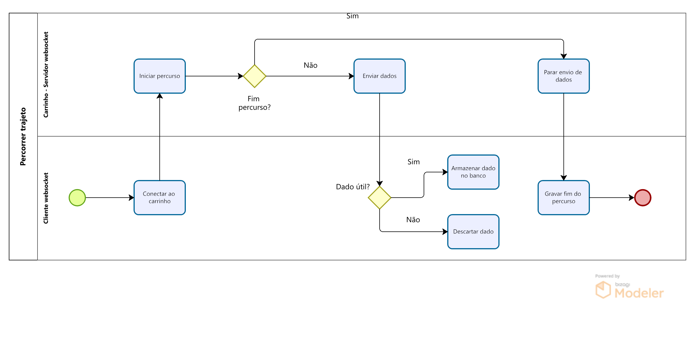

# BPMN 

BPMN (Business Process Model and Notation) é uma notação de modelagem de negócio. Possui um gramática de simbolos para mapear de forma padronizada os processo de uma organização [2].

Foi modelado o processo no qual o carrinho percorre um trajeto determinado.

# Referências

[1] Lucidchart. O que é BPMN?; https://www.lucidchart.com/pages/pt/o-que-e-bpmn

[2] SGANdDERLA, Kelly. Um guia para iniciar estudos em BPMN (I): Atividades e sequência, 19 de novembro de 2012; http://blog.iprocess.com.br/2012/11/um-guia-para-iniciar-estudos-em-bpmn-i-atividades-e-sequencia/

# Histórico de Versão

| Versão | Data       | Descrição      | Autores         | 
| ------ | ---------- | -------------- | --------------- | 
| `1.0`  | 19/05/2024 | Versão inicial BPMN | Samuel Sato | 